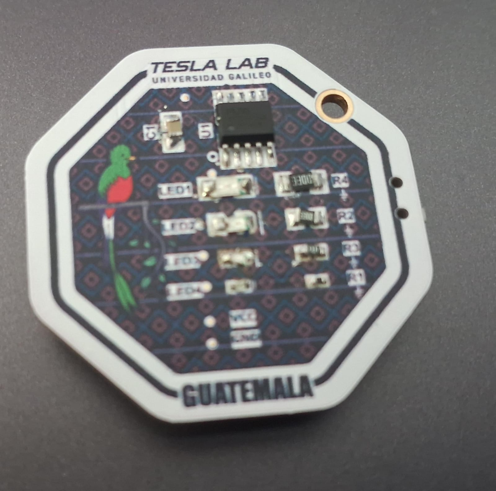
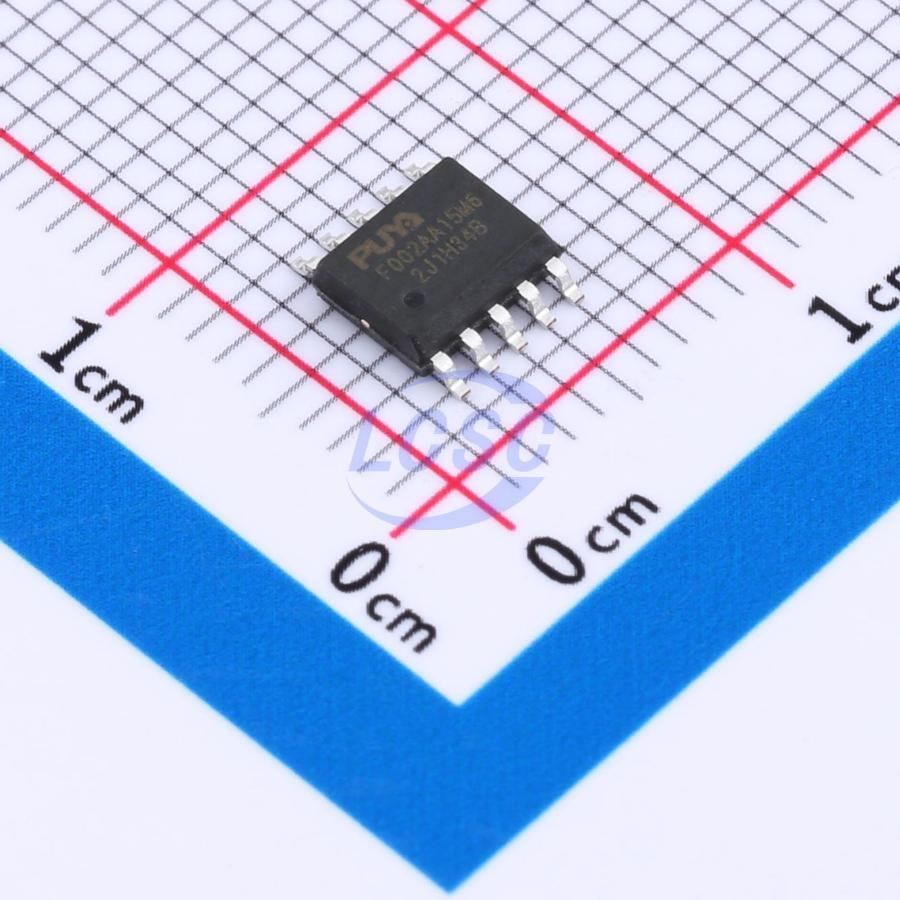
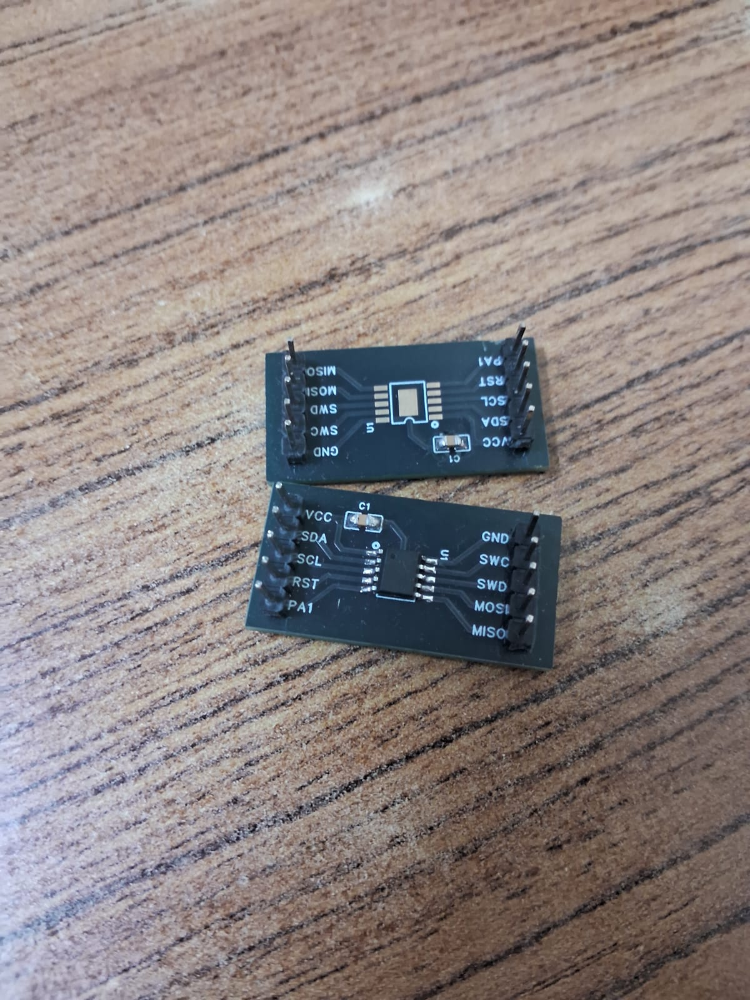
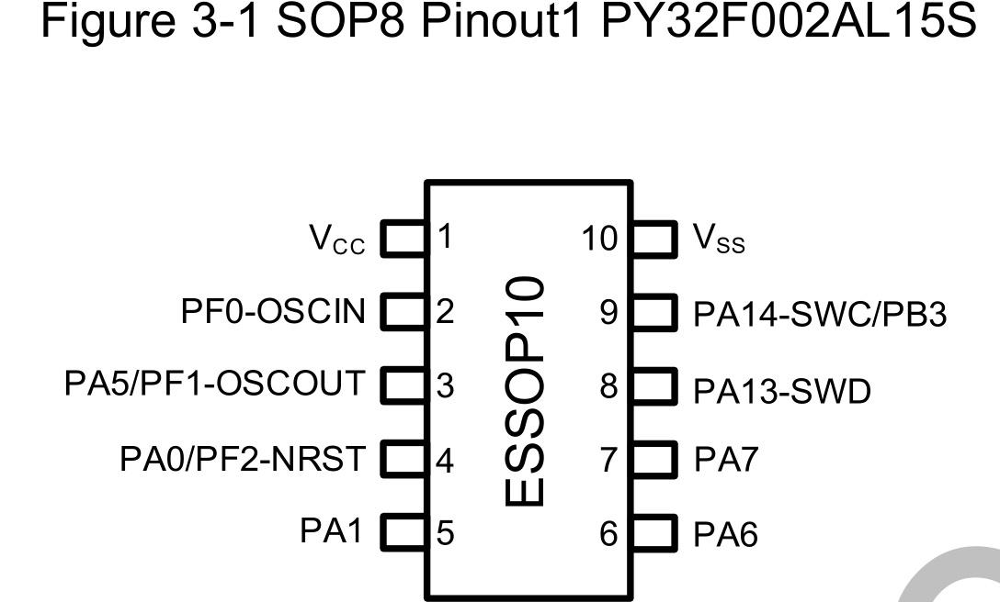

# PY32F002A – Guía de Programación en Keil uVision  


---

## Descripción

Este repositorio documenta la configuración y programación del microcontrolador **PY32F002A (ARM Cortex-M0+)** en Keil uVision, utilizando CMSIS y acceso directo a registros.

El proyecto implementa:

- Inicialización manual de GPIO
- Generación de PWM por software
- Efectos de encendido
- Control simultáneo de múltiples pines

El código fue desarrollado para el **reto de soldadura SMD**



---

## Plataforma

- Microcontrolador: PY32F002A  
- Núcleo: ARM Cortex-M0+  

- IDE: Keil uVision  
- Framework: CMSIS (Common Microcontroller Software Interface Standard)
- Método: Programacion de registros

Referencia técnica:  
- PY32F002A Reference Manual v1.0
- PY32F002A Datasheet v0.2

---
## Configuración de hardware

### Programación mediante ST-Link (SWD)

La programación del microcontrolador se realizó utilizando un programador ST-Link V2 mediante interfaz SWD (Single Wire Debug).


### Conexiones utilizadas

- SWDIO
- SWCLK
- GND
- 3.3V externos

No se alimenta el microcontrolador desde el ST-Link, ya que si se alimenta el microcontrolador entra en modo de funcionamiento y no programa.

El ST-Link debe recibir una señal externa de 3.3V para poder utilizar ese voltaje de referencia para utilizar el voltaje logico apropiado

---


## Base de Programación ESSOP-10


Se utiliza una PCB personalizada para facilitar la conexion del microcontrolador hacia pin headers 



Esta base permite:

- Programación rápida del microcontrolador.
- Validación de continuidad sin soldadura

---

## Esquemático de Conexión SWD


El esquema de conexión incluye:

- SWDIO → SWDIO del micro
- SWCLK → SWCLK del micro
- GND → GND común
- 3.3V → VAPP del ST-Link

| Pinout STLINK | Pinout PY32 |
|---------------|-------------|
|  |  |
---


## Configuración del Proyecto en Keil

1. Instalar el paquete del dispositivo PUYA.
2. Crear un proyecto nuevo en una carpeta independiente.
3. Seleccionar el dispositivo: `PY32F002Ax5`.
4. Activar:
   - CMSIS Core
   - Device Startup
5. Crear el archivo `main.c` dentro del Source Group.

Si ocurre error de definición del microcontrolador, agregar al inicio del archivo:

```c
#ifndef PY32F002Ax5
#define PY32F002Ax5
#endif

```
## Configuración de Hardware

### Habilitación de reloj GPIO
```c
RCC->IOPENR |= RCC_IOPENR_GPIOAEN;
```
Se habilita el reloj para el puerto A.


## Configuración de Pines

Pines utilizados:

- PA1
- PA5
- PA6
- PA7

Configuraciones:

- Modo: Salida
- Tipo: Push-Pull
- Velocidad: Baja
- Sin resistencias pull-up ni pull-down

Registros: 

- GPIOA->MODER
- GPIOA->OTYPER
- GPIOA->OSPEEDR
- GPIOA->PUPDR

## Delay por software 
```c
void delay_ms(uint32_t ms);
```

Implementado con un for haciendo no operation:
```c
__NOP()
```

## PWM con software 
Se usa una funcion para definir el brillo que se le asigna a cada pin

```c
void led_pwm(uint32_t pin, uint8_t brillo);
```
Parametros: 
- pin: número de pin del puerto A
- brillo: valor entre 0 y 100

Funcionamiento:
- Se generan 100 ciclos.
- Se compara contador contra nivel de brillo.
- Se controla directamente GPIOA->ODR.

## Efectos en LEDs
Se crea un array o tabla con 50 elementos que representan el brillo 

### Efecto de despertado 
```c
const uint8_t wake[50];
```
Este efecto simula un encendido en escalon o progesivo


### Efecto Respiración
```c
const uint8_t resp[50];
```
Este efecto se basa en una onda senoidal para dar el efecto suavizado de respiracion 
Se recomienda aplicarlo a todos los pines para resultados mas llamativos

## Diferencias respecto al Documento Base
El PDF de guia describe el proceso de creacion del proyecto, como definir el PWM por software y una curva basica de respiracion a modo de enseñar como hacer tus propios efectos 

## Limitaciones
El sistema tiene limitaciones tecnicas que nacen desde el modo de como se programaron los registros, ya que no es la forma mas eficiente de hacerlo por que: 

- PWM implementado completamente por software.
- No se utilizan timers.
- No se configura explícitamente el clock del sistema.
- Sistema bloqueante dentro del while(1).


### Para aplicaciones reales se recomienda:
- Implementar PWM mediante TIM hardware.
- Utilizar SysTick para temporización precisa.
- Separar lógica en módulos independientes.
- Utilizar interrupciones para eventos con sensores 

## Autoría y Créditos
Tesla Lab – Universidad Galileo 

Desarrollo de firmware: Pablo José López  

Este repositorio es propiedad de Tesla Lab, Universidad Galileo.